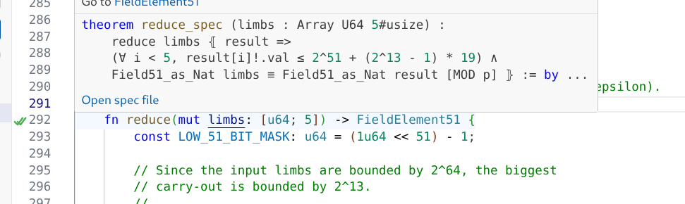

# Aeneas Verify

VSCode extension that shows the formal verification status of Rust functions extracted by [Aeneas](https://github.com/AeneasVerif/aeneas). Gutter icons indicate whether each function has been verified, specified, or just extracted, and hovering shows the Lean spec theorem.



## Icons

| Icon | Meaning |
|------|---------|
|  | **Verified** — spec theorem is proven |
|  | **Specified** — spec theorem written but not yet proven |
|  | **Extracted** — function extracted by Aeneas, no spec yet |

Hovering on the first line of a verified or specified function displays the Lean spec statement, with a link to open the spec file. Hovering on an extracted function offers a one-click option to create a skeleton Lean spec file.

## Install

Download the `.vsix` from the latest [CI build](../../actions) artifacts, then in VSCode: `Ctrl+Shift+P` → **"Extensions: Install from VSIX..."** and select the file.

Alternatively, build from source:

```bash
git clone https://github.com/Beneficial-AI-Foundation/vscode-aeneas.git
npm install
npm run compile
npm run package
```

Then install the generated `aeneas-verify-*.vsix` via "Extensions: Install from VSIX...".

## Configuration

| Setting | Default | Description |
|---------|---------|-------------|
| `aeneas-verify.jsonPath` | `"functions.json"` | Path to verification status JSON (relative to workspace root) |
| `aeneas-verify.showExtracted` | `true` | Show grey dot for extracted-but-unspecified functions |
| `aeneas-verify.specsBasePath` | `"Specs"` | Base path for generated spec files (relative to workspace root) |
| `aeneas-verify.copyrightHolder` | `""` | Copyright holder for spec file headers (leave empty to omit) |
| `aeneas-verify.licenseType` | `"Apache 2.0"` | License type for spec file headers |
| `aeneas-verify.defaultAuthors` | `""` | Default authors line for spec file headers |
| `aeneas-verify.defaultImports` | `[]` | Additional Lean imports (auto-prefixed with crate name) |
| `aeneas-verify.openDeclarations` | `"Aeneas Aeneas.Std Result Aeneas.Std.WP"` | Lean `open` declarations for generated files |

## Commands

- **Aeneas Verify: Reload Verification Data** — re-read `functions.json` without reloading the window
- **Aeneas Verify: Open Lean Spec File** — available from the hover tooltip
- **Aeneas Verify: Create Lean Spec File** — create a skeleton spec file for an extracted function

## JSON schema

The extension reads a JSON file with the following structure:

```jsonc
{
  "functions": [
    {
      "rust_name": "crate::module::Type::method",
      "lean_name": "crate.module.Type.method",
      "source": "src/module.rs",          // relative path to Rust file
      "lines": "L70-L74",                 // line range in Rust source
      "specified": true,                   // has a Lean spec theorem
      "verified": true,                    // spec theorem is proven
      "spec_statement": "theorem ...",     // Lean theorem text (or null)
      "spec_file": "Specs/Module/Add.lean" // path to Lean spec file (or null)
    }
  ]
}
```

## Future feature wishlist

- Warning when Rust source has been modified since the last Aeneas extraction (stale verification)
- Auto-refresh when verification status is updated (watch for Lean build changes)
- Auto-extract function parameters from the Lean definition for generated spec files
